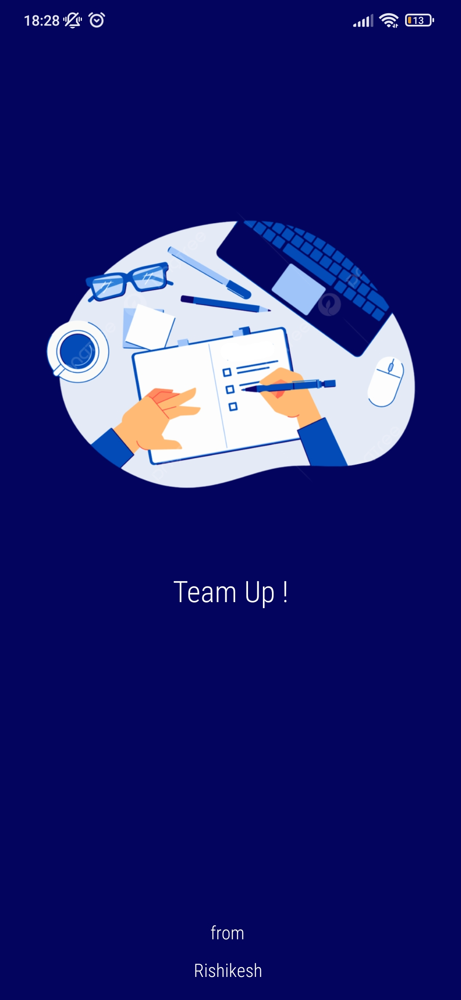
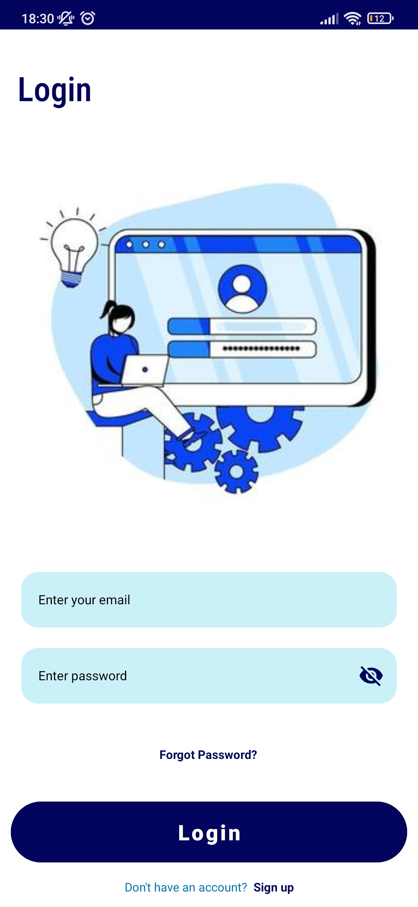
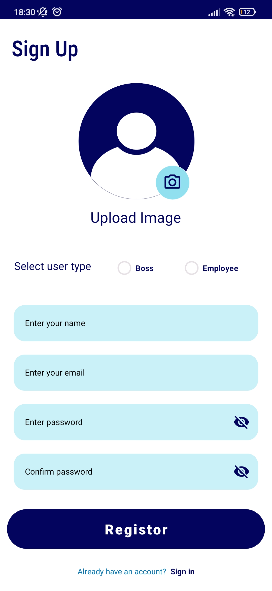
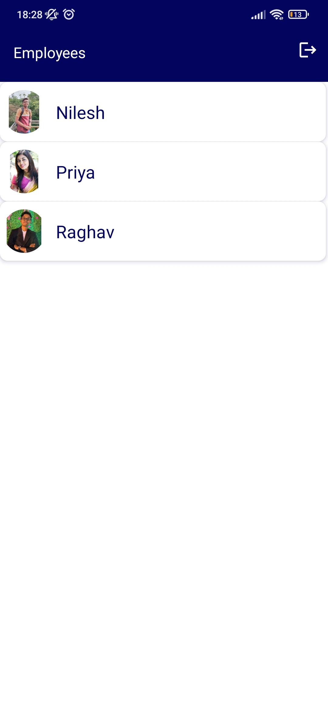
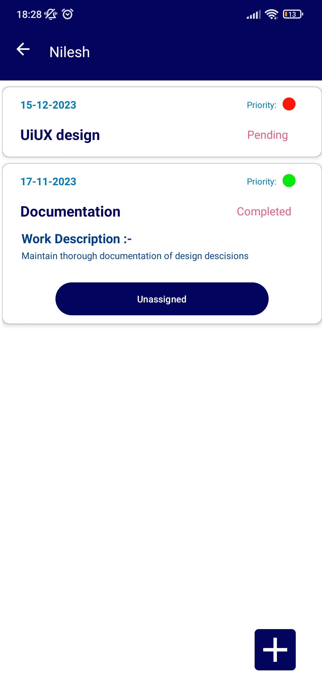
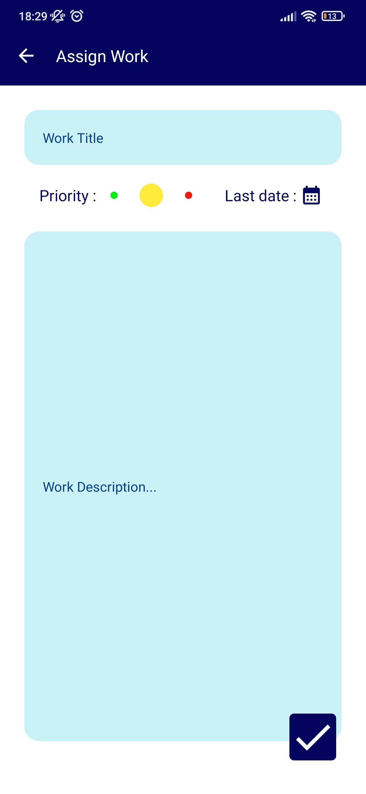
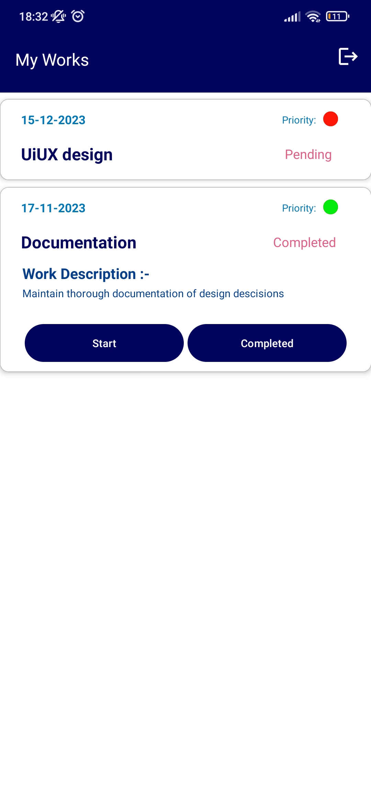

### TeamUp!

**Revolutionizing Work Collaboration**

Welcome to TeamUp!, an Android application designed to streamline collaboration between bosses and employees. This project translates a thoughtfully crafted UI/UX design into a fully functional and user-friendly experience.

## Key Features:

* **Seamless User Onboarding:** Secure and effortless user registration and login facilitated by Firebase Authentication.
* **Robust Data Management:** Efficiently store and manage all file types, from images to documents, with Firebase Storage.
* **Real-time Collaboration:** Experience dynamic and synchronized updates across the workspace, enabling seamless collaboration powered by Firebase Realtime Database.
* **Instant Communication:** Stay connected with the team through timely notifications for task assignments, updates, and completions delivered via Firebase Cloud Messaging (FCM).
* **Efficient Network Requests:** Enjoy a smooth and responsive user experience with Retrofit, simplifying network interactions for seamless data fetching and sending.

## Technologies Used:

* **Kotlin & Android Studio:** Leverage the power of Kotlin's modern syntax and Android Studio's robust development environment for efficient and elegant app development.
* **Firebase:** 
    * **Authentication:** Secure user authentication for enhanced security.
    * **Storage:** Efficiently store and manage all file types.
    * **Realtime Database:** Real-time data synchronization for seamless collaboration.
    * **Cloud Messaging (FCM):** Real-time notifications for instant communication.
* **Retrofit:** Streamline network interactions for a smooth and responsive user experience.

## Installation
### Clone the repository:
git clone https://github.com/Rishi2419/Team-Up-/tree/master

Open the project in Android Studio.
Sync the Gradle dependencies.
Set up Firebase by adding your google-services.json file to the project.
Run the project on an emulator or a physical device.

## For a visual walkthrough of TeamUp!'s functionalities, check out the demo video here: 
https://www.linkedin.com/posts/rishikesh-sahu-error_kotlin-androidstudio-appdev-activity-7130132295230894080-W8Mx?utm_source=share&utm_medium=member_desktop

## Screenshots

<table>
  <tr table border="0">
    <td></td>
    <td></td>
    <td></td>
  </tr>
  <tr>
    <td></td>
    <td></td>
    <td></td>
  </tr>
  <tr>
    <td></td>
  </tr>
</table>
